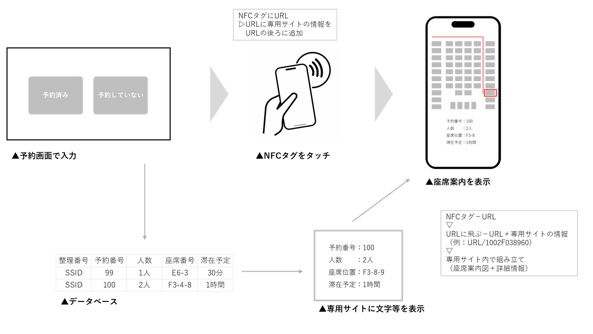
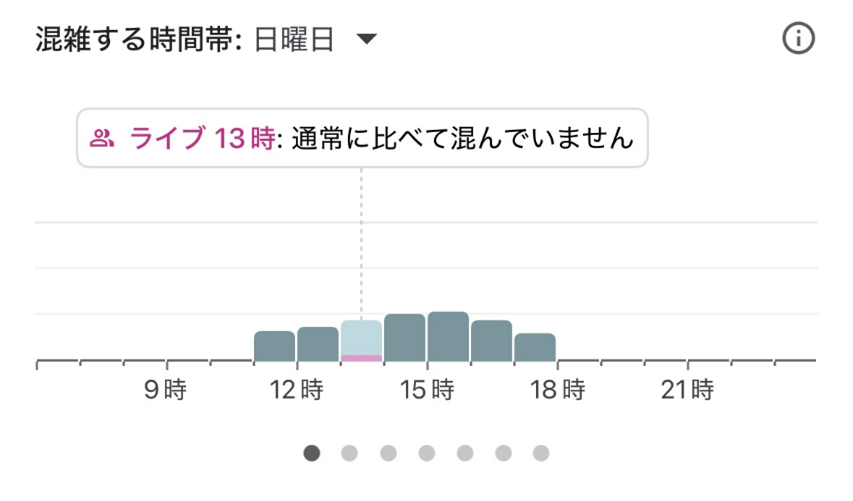
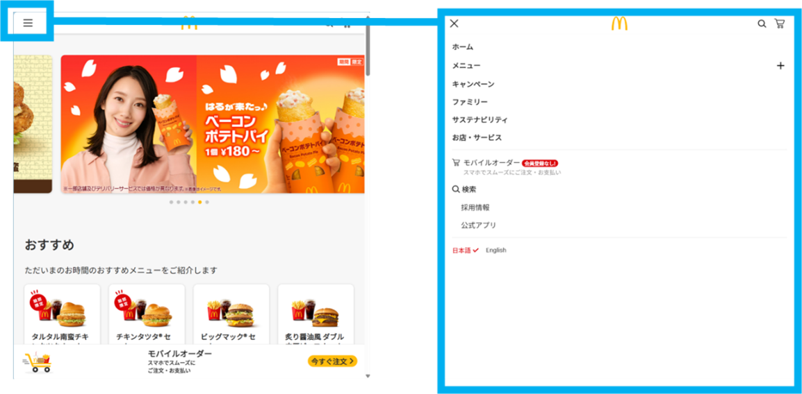

# 座席予約システム要件定義

## 1. 概要

本システムは、大学生協の座席予約を行うためのWebアプリケーションと、その管理機能で構成される。ユーザーは、Web（ブラウザ）上で座席の予約・変更・キャンセルを行い、大学生協の入口でチェックインをして座席の予約を行うことができる。（予約をしなくてもチェックインの際に、その場で座席の確保ができる仕組みも取り入れる予定である。）なお、管理者は、予約状況の管理・座席の管理・システムの設定等を行うことができる。

### 利用者
-   **予約ユーザー**
    -   Web上で座席の予約を行ったユーザー
-   **予約していないユーザー**
    -   Web上で座席の予約をせず、チェックイン場所で座席の確保をするユーザー
-   **管理者**
    -   座席予約システムの運用・管理を行う

### システムの基本構成
-   予約用ユーザーサイト（Webアプリケーション…スマートフォン・PC対応）
-   チェックイン画面（PCかつ専用端末を想定）
-   管理者サイト（Webアプリケーション…PC）
-   データベース
-   サーバー（メール送信不可）

### データベース一覧
-   ユーザー管理ID・パスワード用データベース
-   当日予約分のユーザー情報と予約情報用のデータベース
-   当日の時間ごとの座席管理データベース
    -   10分毎の予約時間（営業時間内）
-   時間ごとの座席状況を管理するデータベース
    -   予約ごとに以下の情報を含むレコードを管理する。
        -   整理番号・利用人数・予約日時・滞在予定時間・指定座席番号・予約ステータス等
-   管理者ID・パスワード用データベース

## 2. 用語

-   **予約ユーザー**
    -   システムを利用して座席を予約するユーザー。
-   **予約していないユーザー**
    -   システムで座席を予約していないユーザー。チェックイン時に手続きを行う。
-   **ユーザーログイン**
    -   各ユーザーごとのIDとパスワードを設定
        -   追加に関しては、メールをつかえないことから自動追加もしくは管理者が認証
    -   Googleアカウントを使用した認証も可能
-   **QRコード**
    -   予約情報やチェックイン用情報を含む二次元コード。
    -   Google Chart API等を使用。
-   **予約情報**
    -   予約に関する詳細データ
    -   整理番号、人数、予約日時、滞在予定時間、メールアドレス、座席指定等
-   **整理番号 (UUID)**
    -   各予約を一意に識別するためのID
    -   UUIDの使用を想定（当日分の予約だけなら、ユーザーIDで管理可能）
-   **滞在予定時間**
    -   ユーザーが座席を利用する予定の時間を予約やチェックインの際に収集。
    -   例：「すぐ食べ終わる (20分)」「ゆっくり食べる (40分)」「長時間滞在予定 (1h以上)」
-   **チェックイン**
    -   ユーザーが予約した座席またはその場で確保した座席の利用開始の手続き
-   **管理者ID・パスワード**
    -   管理者一人一人に発行
-   **予約用ユーザーサイト**
    -   ユーザーが座席の予約、変更、キャンセル登録等を行うためのWebサイト
-   **チェックイン画面/サイト**
    -   ユーザーが大学生協の入口でチェックイン手続きを行うための画面
-   **管理者サイト**
    -   管理者がシステムの管理・運用を行うためのWebサイト
-   **仮予約**
    -   オーバーブッキングを避けるため、ユーザーが座席を選択した時点で一時的に座席を確保する状態

## 3. 機能

### ユーザー向け機能

-   **ログイン機能**
    -   IDやパスワードを入れてログイン
-   **新規予約機能**
    -   **予約情報入力機能**
        -   利用人数、希望日時、滞在予定時間、メールアドレス、座席指定等を入力
    -   **入力情報確認機能**
        -   入力した予約情報を確認し、必要に応じて修正のために前画面に戻れる機能
        -   （戻った際、入力済み情報は保持される）
    -   **空席確認機能**
        -   入力された条件に基づいて、座席管理用データベースを参照して予約可能な空き状況を確認
        -   空き状況を表示し、座席を選択した時点で仮予約（人数以上の座席選択は不可）
    -   **予約確定機能**
        -   確定ボタンを押した時点で、予約を確定
    -   **QRコード・予約情報表示機能**
        -   予約済みの場合には、新規予約の部分にQRコード・予約情報を表示
        -   （新たな新規予約はできないようにする）
-   **予約変更機能**
    -   **既存予約の呼び出し機能**
        -   予約番号やメールアドレス等を利用
    -   **予約内容変更機能**
        -   呼び出した予約情報を自動で出力し、変更した内容をデータベースで書き替え
    -   **変更内容確認・確定機能**
        -   新規予約機能の入力情報確認機能と同様
    -   **変更後情報送信機能**
        -   変更が確定した場合、新たな予約情報とQRコードに更新
-   **予約キャンセル機能**
    -   **既存予約の呼び出し機能**
        -   予約番号やメールアドレス等を利用
    -   **キャンセル実行機能**
        -   予約のキャンセルをするかの確認画面を経て、予約情報やQRコードを消し、データベース内のデータを削除

### チェックイン機能（チェックイン画面）

-   **設置場所**：大学生協の入口など、利用者がアクセスしやすい場所に設置。
-   **予約有無選択機能**：ユーザーが「予約している」か「予約していない」かを選択する。
-   **予約済みユーザー向けチェックイン機能**
    -   **QRコード読み取り機能**
        -   事前にログインした画面に表示された予約用QRコードを、チェックイン機（PC）のインカメラでスキャン
    -   **予約情報自動入力・表示機能**
        -   QRコードから読み取った予約情報を画面に自動入力し表示する。
    -   **予約情報変更機能**
        -   チェックイン時に変更があればデータベースを通して確認
    -   **チェックイン確定機能**
-   **予約なしユーザー向けチェックイン機能**
    -   **予約情報入力機能**
        -   利用人数、希望日時、滞在予定時間、メールアドレス、座席指定等を入力
    -   **入力情報確認機能**
        -   入力した予約情報を確認し、必要に応じて修正のために前画面に戻れる機能
        -   （戻った際、入力済み情報は保持される）
    -   **空席確認機能**
        -   入力された条件に基づいて、座席管理用データベースを参照して予約可能な空き状況を確認
        -   空き状況を表示し、座席を選択した時点で仮予約（人数以上の座席選択は不可）
    -   **チェックイン確定機能**
        -   確定ボタンを押した時点で、チェックインを確定
-   **入力制限機能**: 管理者側の意図した情報以外を入力できないような画面設計

### 管理者向け機能

-   **ログイン機能**
    -   **ID・パスワード認証機能**
    -   **個別ID・パスワード発行機能**
        -   同時ログインを行うために、管理者ごとに個別のIDとパスワードを発行
-   **予約管理機能**
    -   **予約情報一覧表示機能**
        -   予約されている情報・座席情報の一覧を確認
    -   **座席混雑マップ表示機能**
        -   日時を選択すると、10分ごとの座席の混雑状況をマップ形式で表示
    -   **強制予約取消機能**
        -   管理者が特定の予約を強制的にキャンセルする機能
        -   キャンセル時には利用者に自動でメール通知（※サーバーがメール送信不可のため、この機能は再検討が必要）
    -   **予約受付強制停止機能**
        -   システム全体または特定時間帯の新規予約受付を一時的に停止する機能
        -   停止中はユーザーサイトにポップアップ等で表示する。
-   **QRコード発行システム連携**
    -   予約情報に基づいてチェックイン用QRコードを生成
        -   自動で発行・更新する機能（Google Chart API等）
-   **システム設定機能**
    -   予約に関する各種パラメータ（予約可能期間、一予約あたりの最大人数など）を設定

## 4. 非機能要件

### 信頼性・正確性
-   オーバーブッキング防止
    -   座席選択時に仮予約（一定時間席を確保）を行い、他のユーザーとの同時予約による重複を防ぐ
    -   予約変更時等も同様
    -   同一ユーザーによる同一日時（前後1時間程度を含む）での重複予約
    -   必要なら、新規予約のボタンを押した段階で整理番号を発行し、データベースに書き込む順番を決定（トランザクション管理？）

### セキュリティ
-   機密性について
    -   管理者サイトへのアクセスは一意のIDとパスワードによる認証を必須とし、権限のないユーザーのアクセスを防止すること
    -   全てのWebページにおいてHTTPSを使用して通信データを暗号化すること
    -   時間があるときには、個人情報保護の観点から、GmailのAPIを利用して、メールアドレスの入力以外に個人情報を収集せずに利用できるシステムを考案（後述）
- 　完全性について
    -   ユーザーとシステム間で送受信されるデータが、第三者に改善されないようHTTPSを使用することで通信データを暗号化し、データの完全性を保証すること
    -   入力値検証をサーバーサイドでも行い、不正なスクリプトの入力を禁止
    -   予約情報の入力には、SELECTタグ等のユーザーが直接入力できないようにする対策を実施
    -   メールアドレスの形式が正しいかのチェックをすること
    -   禁止する特定の文字列（<script>・データベースの追加や削除のコードなど）を検出し、拒否する方式を取ること
    -   50文字以上の極端に長い文字列を禁止すること
-   可用性について
    -   DDoS攻撃への対策
        -   Firewallの設定をすること
　	    -   攻撃元のIPアドレスを特定できた際に、ブロックリストに追加すること
            （実際には、学内Wi-Fi等は、たくさんのユーザーが利用することを考慮）　
        -   大量のアクセスによるサービス停止を防ぐための対策を検討（IPアドレス制限、リクエストレート制限等）

### ユーザビリティ
-   アイコンと文字を効果的に使用し、ユーザーが迷わず操作
    -   ナビゲーションバー等
-   入力情報の保持
    -   画面遷移時には、既に入力された情報を保持し、再入力の手間を省く
-   操作制限
    -   チェックイン画面で管理者側の意図しない情報や操作を行えないように、機能を制限
-   多言語対応
    -   日本語および英語に対応？

### 性能
-   大量アクセス対応
    -   多数の同時アクセスに対応
-   以下のデータベースは、当日の00:00に新たなものを作成
    -   当日予約分のユーザー情報と予約情報用のデータベース
    -   当日の時間ごとの座席管理データベース
    -   時間ごとの座席状況を管理するデータベース

### 運用・保守性
-   管理者複数ログイン対応
    -   複数の管理者が同時に管理者サイトにログインして作業可能
-   QRコード自動化
    -   予約確定時や変更時に、QRコードを自動で生成し出力

## 5. 全体の流れ

### 予約したユーザー

-   **予約**
1.  ユーザーは、スマートフォンまたはPCから予約用ユーザーサイトにアクセスし、ログインを行う
2.  「新規予約」を選択
     -   既に予約がある場合は、その予約情報とQRコードが表示（新たな新規予約はできない）
3.  利用人数、希望日時、滞在予定時間等の予約情報を入力
    -   システム設定で座席指定が可能な場合は、座席も選択
    -   座席は、その時点でのデータをリアルタイムで反映
    -   座席を選択した時点で仮予約状態となる
4.  入力内容を確認画面で確認
    -   必要であれば入力画面に戻り修正（入力内容は保持される）
5.  「確定」ボタンを押す
6.  ユーザーに予約完了を通知。同時に、予約情報とチェックイン時に使用するQRコードをサイト内に表示
-   **予約の変更**
1.  ユーザーは、予約用ユーザーサイトにログイン後
2.  「予約変更」機能を選択
3.  予約番号やメールアドレス等で該当の予約を呼び出す
4.  変更の場合は、呼び出された予約情報が表示された画面で、希望する内容に変更
5.  変更内容を確認画面で確認後、「確定」ボタンを押す
6.  変更後の予約情報とQRコードが画面に更新表示され、画面内でも通知
-   **予約のキャンセル**
1.  ユーザーは、予約用ユーザーサイトにログイン後
2.  「キャンセル」機能を選択
3.  「キャンセル実行」ボタンを押し、確認画面を経て手続きを完了
     -   予約情報やQRコードは削除され、データベース内のデータも更新
     -   キャンセル完了の通知を送信（※サーバーがメール送信不可のため、画面通知のみ）
-   **チェックイン**
1.  ユーザーは、大学生協の入口で、設置されているチェックイン画面（PC端末等）を操作
2.  「予約している」ボタンを選択
3.  事前に予約用ユーザーサイトのログイン後画面に表示されたQRコードを、端末のカメラ（インカメラ等）で読み取らせる
4.  画面に自身の予約情報が自動で表示されるので確認（システムが許容する範囲で変更も可能に）
5.  「確定」ボタンを押す
6.  割り当てられた座席位置を画面に表示

### 予約していないユーザー

-   **チェックイン**
1.  ユーザーは、大学生協の入口で、設置されているチェックイン画面（PC端末等）を操作
2.  「予約していない」ボタンを選択
3.  必要情報を入力
4.  入力内容を確認画面で確認し、必要であれば修正（入力内容は保持される）
5.  画面に自身の予約情報が自動で表示されるので確認（システムが許容する範囲で変更も可能に）
6.  「確定」ボタンを押す
7.  割り当てられた座席位置を画面に表示

### 管理者

-   **予約状況の確認・管理**
1.  管理者は、管理者サイトにアクセスし、専用のIDとパスワードでログイン
2.  必要な項目を選択
3.  設定や操作を行う

## 6. 時間があれば実装する機能の候補

### キャンセル待ち

-   **新たに導入する必要のあるシステム**
    -   キャンセル待ち登録用ユーザーサイト（スマートフォン・PC対応）
    -   キャンセル待ち確定用ユーザーサイト（スマートフォン・PC対応）
-   **キャンセル待ち機能**
    -   **キャンセル待ち登録機能**
        -   希望日時が満席の場合、キャンセル待ち用のメールアドレス等を入力して登録
    -   **空き発生時URL送信機能**
        -   キャンセル等で空きが発生した場合、何らかの方法で通知（※メール送信不可のため、画面上の通知や代替手段を検討）
    -   **予約情報確認・変更機能**
        -   送信されたURLからアクセスし、予約情報を確認、必要であれば変更
    -   **キャンセル待ちからの予約確定機能**
        -   確認画面を経て予約を確定
    -   **自動キャンセル機能**
        -   規定時間以内に予約が確定されない場合や、希望日時を過ぎた場合には自動的にキャンセル待ち登録を無効化し、その旨を通知
            （※メール送信不可のため、代替手段を検討）
-   **流れ（ログインなしの場合）**
    ※ユーザーがサイトで希望日時等の予約を試みるが、該当の席が埋まっている場合
1.  画面内で「キャンセル待ち登録」機能を選択
    -   サイト内やチェックイン画面からしか飛べない
2.  キャンセル通知を受け取るメールアドレス等を入力し登録
3.  希望条件に合致するキャンセルが発生した場合、システムは登録されたメールアドレス宛に、予約手続き用の個別URLを自動送信
    （※メール送信不可のため、代替手段を検討）
4.  ユーザーは、メール内のURLをクリックし、キャンセル待ち確定用ユーザーサイトにアクセス（※上記に伴い変更）
5.  表示された予約情報（事前入力されている情報）を確認し、必要であれば変更
6.  確認画面を経て「予約確定」ボタンを押す（規定時間内に操作が必要）。
7.  システムは予約を確定し、予約情報とチェックイン用QRコードを画面に表示し、メールでも自動送信（※メール送信不可のため、画面表示のみ）

### GmailのAPI

-   現システムのIDとパスワードは、メールによる予約管理を行うことができれば、必要ないので、メールを自動で送れるシステムを作ることができるようにする
-   実現可能性が不明なので、とりあえずはログインの仕組みを作り、余裕があればGmail等のAPIを使った仕組みを考える。
    （※「サーバー（メール送信不可）」の制約と矛盾するため、サーバー構成の変更または別の通知手段の検討が必要）

### NFCタグによる座席案内機能

1.  チェックイン端末で、予約済みか予約していないかを選択すると同時に、データベースに新たなレコード枠（チェックイン情報）を追加
2.  リアルタイムで最新のレコードを専用サイト（非公開）に表示
3.  チェックイン端末付近に設置されたNFCタグから、スマートフォンで静的URLを読み取る
    -   URL内に、そのURLの後ろに追加するための文字列（専用サイトの情報から作成）を埋め込み、動的に座席案内用URLを生成して自動で移動
4.  新たな座席案内用URL内で、URL後部の文字列情報をもとに、個別の座席への案内図や座席情報を表示

### 混雑状況

-   **表示位置**
    -   新規予約・予約変更・キャンセル機能と同じ予約用ユーザーサイト画面の上の方
-   **表示方法**
    -   混雑状況を棒グラフ等で視覚的に表示する。（参考: Google Map のような時間帯別混雑表示）
    -   表示粒度: 曜日ごとではなく、利用人数ごとの混雑状況表示を検討
-   **実装方法（案）**
    -   座席管理用データベースの情報をリアルタイムに集計し、人数ごと・1時間ごとの混雑具合を示すデータベースを（仮想的に）作成
    -   混雑状況用データベースの情報をもとに、棒グラフなどの形式でWeb上に表示

### メニューバー（ユーザー画面）

-   現在のユーザー画面は、単一ページ構成に近い。
    -   より多くの機能へのアクセスを提供するため、メニューバーの導入を検討（参考: マクドナルドHPなどのメニューバー構成）

-   **メニューバーの内容候補**:
    -   **予約関連**
        -   新規予約
        -   予約変更・キャンセル
    -   **混雑状況・予想**
        -   現在の座席混雑状況
        -   今後の混雑予想
    -   **空席検索**
        -   その日の空席状況（座席混雑度マップ表示、10分ごと）
    -   **メニュー情報**
        -   今日のメニュー一覧表示（参考: マクドナルド公式メニュー）
    -   **店舗情報**
        -   営業時間・大学開講状況（・大学授業数）
            -   混雑予想にも利用
        -   大学MAP（既存のものを利用）
    -   **言語設定**: 日本語/英語 切り替え
-   **機能詳細**
    -   **混雑状況・予想**
        -   **現在の混雑状況**：予約画面上部と同様の人数別グラフを表示。
        -   **今後の混雑予想**:
            -   大学の授業カレンダー等と連携し、予約数や過去の利用データも加味して予測
            -   曜日、講義数、時間帯、過去の座席利用状況などを基に算出
            -   **新たに必要なデータベース**
                -   大学の授業日カレンダー
                -   大学の曜日ごとの講義数・講義教室・受講者数（シラバス等からの自動取得可能性を検討）
                -   過去の座席利用状況（曜日ごと・人数ごと）
    -   **空席検索**
        -   **その日の空席状況**: 座席混雑度マップ形式で表示（10分ごとの更新）。
    -   **メニュー情報**
        -   大学生協などの今日のメニュー一覧（写真、値段、カロリー、名前等も）
        -   **更新方法**: 管理者が管理画面の選択リスト（selectタグ等）で毎日更新できる仕組み
        -   **新たに必要なデータベース**
            -   メニュー一覧データベース（商品名、価格、画像パス、カロリー等）
